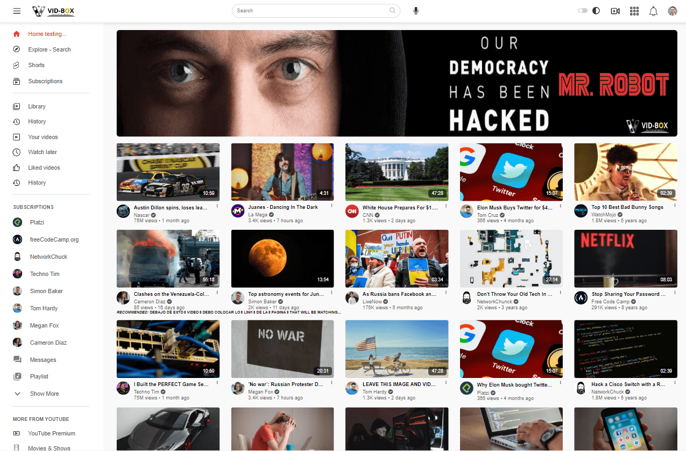

# Vid-Box Website
## Youtube clone Project

This repo is part of a [#PlatziChallenge](https://platzi.com/blog/portafolio-web-2022/).

Vid-Box is a Youtube Clone project. it started as a project developed on a Platzi Live class. in which I learned new concepts. The site was not fully funtional or responsive and I wanted more. So I put some work and managed to add new features and make it what its now. A responsive site with a darkmode button, a hidden sidebar menu and a working Search Box that consume a youtube API.

## Challenge 🎲
text

<!-- BUILD WITH -->

### Built With 🔑

This class is based on Hyper Text Markup Language (HTML), Cascading Style Sheets(CSS) but most importantly Javascript (JS).

    

<!-- CONTENT -->

## Content 🚦

This course is part of a [Platzi Challenge](https://platzi.com/blog/portafolio-web-2022/) I participated on. In which for two months, I got the oportunity to join 24 live meeting and multiple classes with the only purpose of creating a Web Portaflio.

### Project deployed using:
 - Vercel: [View Demo](https://youtube-ten-beta.vercel.app/)

- Github Pages: [https://juanpablodiaz.github.io/youtube](https://juanpablodiaz.github.io/youtube/)

<!-- VIEWS -->

### Desktop Screen 💻

### Mobile Screen 📱

<!-- PROJECTS -->

## Projects 🚀

<!-- CONTACT -->

## Contact 📞

<!-- ACKNOWLEDGMENTS -->

## Acknowledgments 📚

Resources list that I find helpful and would like to give credit to.

### Video Tutorials:
- [Platzi](https://www.platzi.com/)
- [Escuela de Javascript](https://platzi.com/escuela-javascript/)
- [Escuela de Desarrollo Web](https://platzi.com/web/)
- [#PlatziChallenge](https://platzi.com/blog/portafolio-web-2022/) 🎯
Crea tu Portafolio como Web Developer 2022
- [Easy Tutorials](https://www.youtube.com/watch?v=4ykAepVkG5Y)
- [Youtube API](https://www.youtube.com/watch?v=fOKgHld96mU)
- [Enter key in JS](https://www.youtube.com/watch?v=-BgTrpvOFFc)

### Pages used:
- [Google Fonts](https://fonts.google.com/)
- [Google Icons](https://fonts.google.com/icons)
- [fontawesome](https://fontawesome.com/)
- [flaticon](https://www.flaticon.com/)
- [coolors](https://coolors.co/)
- [iloveimg](https://www.iloveimg.com/)
- [GitHub Pages](https://pages.github.com/)

(<a href="#top">👆top👆</a>)

<!-- MARKDOWN LINKS & IMAGES -->
<!-- https://www.markdownguide.org/basic-syntax/#reference-style-links -->

